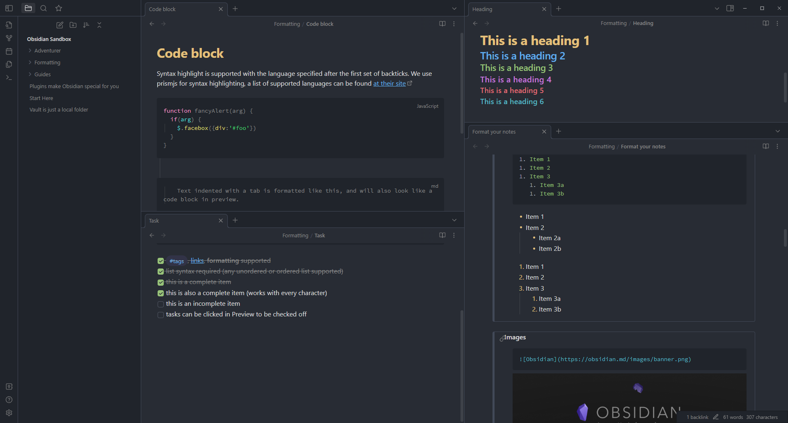

# Obsidian Atom with colorful titles

A theme for Obsidian based on Atom's One Dark and One Light themes.

## Installation

1. Download last Version from release
2. Import One dark folder inside `.obsidian/themes`
3. In Obsidian, click Settings -> Plugins make sure `Custom CSS` is enabled 
4. Pick either light or dark theme in Obsidian's appearance settings!
